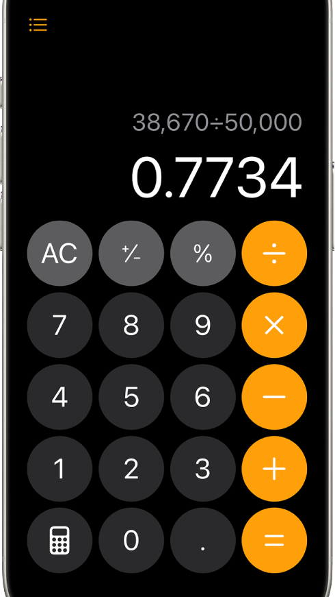

# Calculator

A simple and interactive calculator application built using HTML, CSS, and JavaScript. This calculator supports basic arithmetic operations and provides a clean, user-friendly interface for performing calculations.

## Features

- **Basic Arithmetic Operations**: Addition, subtraction, multiplication, and division.
- **Clear Button**: Allows users to reset the calculator and start fresh.
- **Responsive Design**: Adjusts to various screen sizes, making it usable on both desktop and mobile devices.
- **Real-time Calculation**: Instantly updates the display as buttons are pressed.
- **Keyboard Support**: Users can input numbers and operations using their keyboard for faster access.

## Preview



## Technologies Used

- **HTML5**: For the structure of the calculator.
- **CSS3**: For styling and layout, ensuring responsiveness.
- **JavaScript**: For the core functionality and interaction handling.

## Installation

1. Clone the repository:
   ```bash
   git clone https://github.com/your-username/calculator-js.git
   ```
